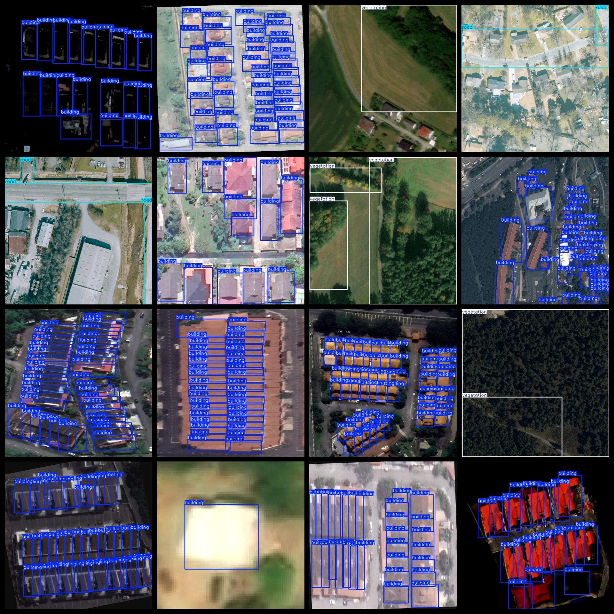
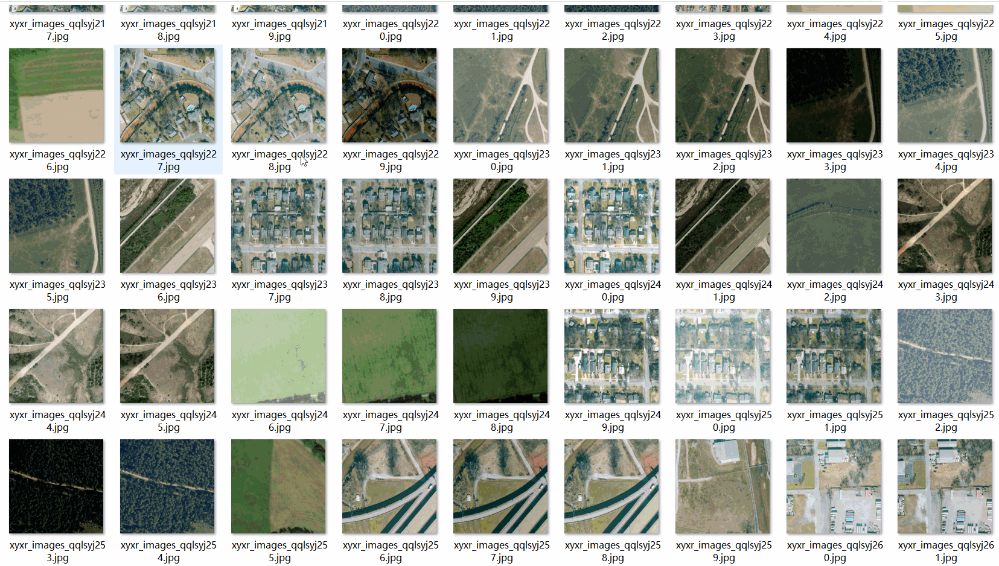

# UAV Aerial Building Vegetation Road Dataset 4081 imagesVOC+YOLO format

The dataset of drone aerial photography, buildings, vegetation and road is 4081 VOC+YOLO format.

Dataset Format: VOC format + YOLO format

The compressed file contains: three folders, each storing images, xml files, and text files.

Total jpg images in JPEGImages folder: 4081

The total number of XML files in the Annotations folder is 4081.

The total number of txt files in the labels folder is 4081.

Number of tag types: 3

Tag names: ["building","road","vegetation"]

Tags: ["Building", "Road", "Vegetation"]

The number of boxes for each label (Note that the order of labels in the Yolo format does not correspond to this, but is based on the classes.txt file in the labels folder):

building frame count = 79273

road frame count = 1778

vegetation frame count = 2816

Total boxes: 83867

Image Clarity (Resolution: Pixels): Clear, average

Image Enhancement: Yes

GitHub Repository Location: datasets_sl

Shape of the label: Rectangular box, used for object detection and recognition.

Important Note: None

Special Notice: This dataset does not guarantee the accuracy or precision of the trained models or weight files. The dataset only provides accurate and reasonable annotations.

Annotation and image details are as follows:

## Images

---

Here is a pay link on Stripe (https://buy.stripe.com/3cs8yP7sY87d0vu9AB). Please contact me lonlonago@foxmail.com after funding $89, and I will send you a complete data files, thank you!

